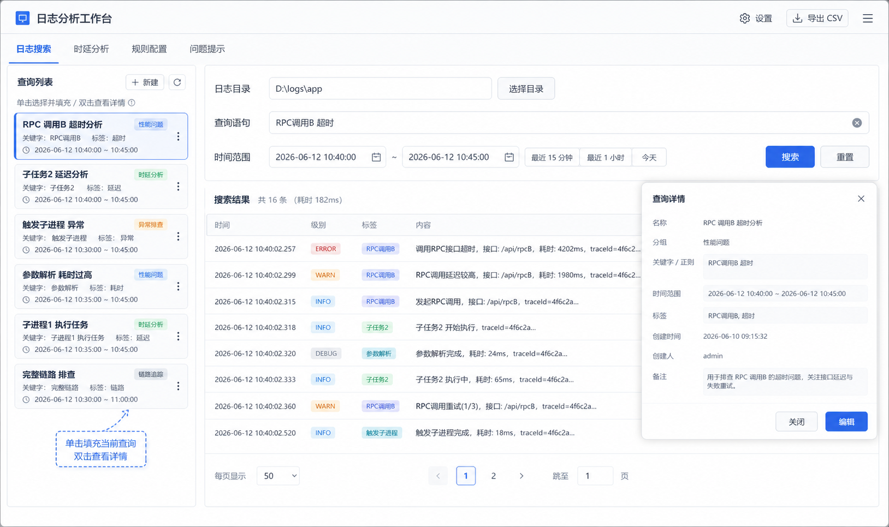

Document ID: UI-BASELINE
Status: Approved
Approved by: 用户
Approved at: 2026-07-09
Depends on: REQ-SEARCH, REQ-SAVED-QUERY, REQ-LATENCY, REQ-VIEW
Supersedes: docs/vscode/specs/latency-selected-request-app-lanes.svg

# 项目 UI 基线

本目录保存当前项目已经确认的界面基线和原型图。后续页面实现、布局调整、交互拆分和技术架构说明，都应以这里的内容为准。

## 已确认的 UI 资产

- `latency-analysis-approved.svg`：时延分析页面的早期基线，保留作为时延分析方向参考。
- `log-search-workbench-wireframe.png`：日志搜索页与查询管理页的原型图，体现当前确认的页面结构和交互分工。
- `rule-config-layered-import-wireframe.svg`：规则包版本树、完整 ZIP 导入和节点编辑弹窗的低保真原型，待本轮确认。

## 当前页面约定

### 日志搜索页

- 页面顶部放置日志文件夹选择，与日志搜索条件同一行，便于先选目录再搜索。
- 左侧为查询列表，可折叠，支持按分组筛选。
- 查询列表提供“新建”入口，创建和查看详情都通过弹窗完成。
- 单击查询项会填充到当前搜索条件中。
- 双击查询项会打开详情弹窗。
- 主页面只保留搜索相关操作，不把编辑表单直接铺在页面上。

### 时延分析页

- 页面以单次请求为中心，展示该请求的泳道图、步骤树和区间统计。
- 左右侧面板都支持折叠，避免挤压中间主视图。
- 步骤卡片和树节点都需要展示业务含义、相对时延和阶段时长。
- 鼠标悬浮或选中某个阶段时，展示起止时间戳、相对起点的开始时间和耗时。
- 底部统计区用于展示区间统计，不与步骤树争抢空间。

### 规则配置页

- 左侧使用“版本 -> 层级 -> 节点”的紧凑树；单击查看概要，双击在弹窗内编辑节点。
- 导入入口只接收完整 ZIP 规则包；`manifest.toml` 声明版本和层级文件映射。
- 用户可在导入前自行使用外部 AI 检查文件；页面不接入或展示该检查过程。
- 应用完成本地校验后，同版本整包覆盖，不存在的版本直接新增；页面只展示会阻断导入的本地校验结果。

## 设计边界

- 这个目录只负责展示层的基线，不定义日志解析、时延计算或规则抽象的业务实现。
- 如果 UI 只改样式、不改数据结构，优先修改展示层，不要反向改动分析逻辑。
- 如果页面布局变化会影响信息完整性，必须先更新这里的原型或说明，再改实现。
